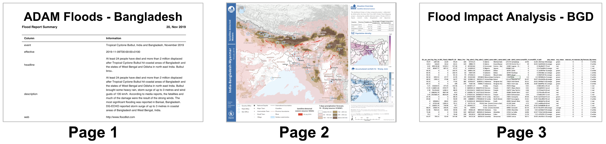
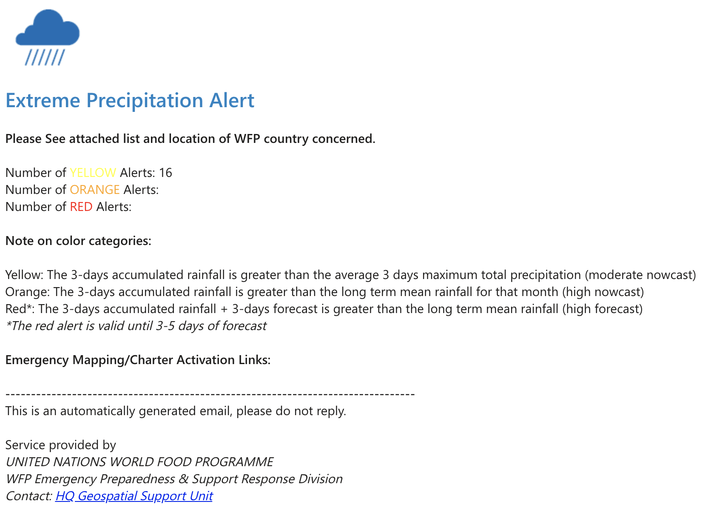
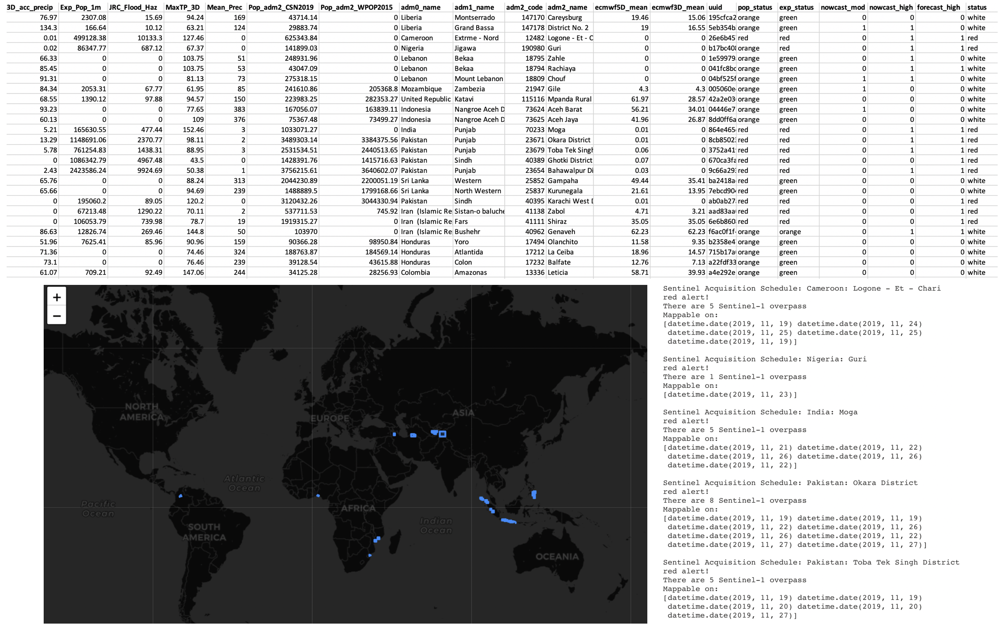

## WFP Automated Alerting System
This project is designed to provide near real time flood information and analysis as soon as the data becomes available.

The script is divided into several processes mainly:
1. Extreme Rainfall Detection and Alerting System (ERDAS)
2. Global Flood Reporting Tool
2. [Automated Flood Mapping](https://github.com/wfp/ADAM-floods)

Below is the final Automated Flood Mapping system which produces a flood summary report, a flood map / dashboard and a flood analysis table in that area.

## Extreme Rainfall Detection and Alerting System (ERDAS)

## Global Flood Reporting Tool
Lorem ipsum

Future changes: